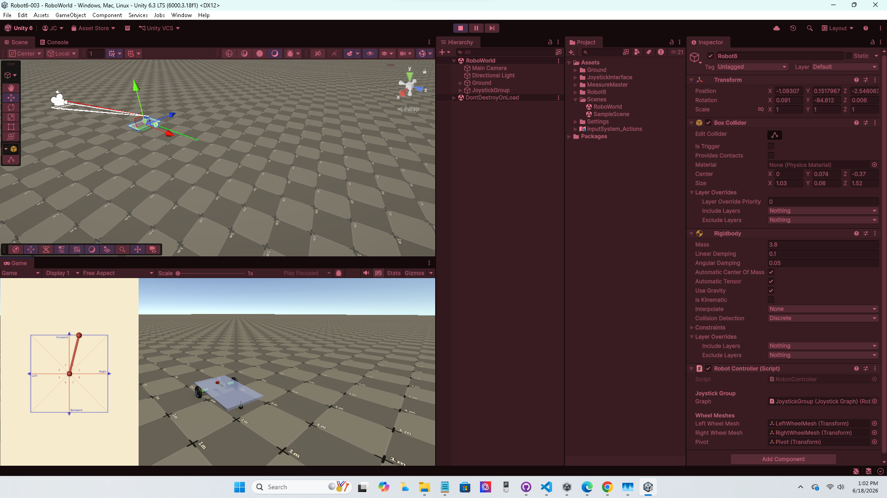

# Robot-6

Robot-6 is a Unity robot simulation package for wheeled robot demos. This repository is intentionally kept simple so readers can quickly review the source code and download the package.

## Quick Facts

- Unity version: 6.3 LTS
- Author: Jesse Carpenter
- License: MIT
- Package download: `Robot6-003.unitypackage`

## What You Get

- Downloadable Unity package release
- Source files for robot control, joystick input, and camera behavior
- Input Actions reference file
- Short documentation for usage and release history

## Quick Start

1. Open your Unity 6.3 LTS project.
2. Import `Robot6-003.unitypackage` with `Assets > Import Package > Custom Package...`.
3. Add the imported Robot-6 objects/scripts to your scene, or open `Source/Scenes/RoboWorld.unity` for reference.
4. Press Play and verify keyboard, joystick, and camera behavior.

## Controls

- `A` / `D`: Horizontal keyboard input
- `W` / `S`: Vertical keyboard input
- Left mouse button: Move joystick grip
- Right mouse button: Rotate main camera around robot
- Mouse wheel: Zoom camera in and out

## Project Notes

- Source is provided for transparency and study.
- The package remains the easiest way to use the project in Unity.
- The project uses Unity New Input System concepts for joystick and keyboard behavior.
- Robot motion can be driven from either keyboard input or joystick UI input.
- Two joystick algorithm files are intentionally kept: `Source/JoystickInterface/Scripts/Joystick/Algorithm.cs` and `Source/Robot6/Scripts/Code/Joystick/JoystickAlgorithm.cs`.
- Input System reference: [Unity Input System Workflows](https://docs.unity3d.com/Packages/com.unity.inputsystem@1.19/manual/Workflows.html)

## Source Files

- `Source/Robot6/Scripts/RobotController.cs`
- `Source/Robot6/Scripts/Code/Joystick/JoystickAlgorithm.cs`
- `Source/Robot6/Scripts/Code/MainCamera/RobotCamera.cs`
- `Source/Robot6/Scripts/Code/Steering/Steer.cs`
- `Source/JoystickInterface/Scripts/Joystick/Algorithm.cs`
- `Source/JoystickInterface/Scripts/JoystickGraph.cs`
- `Source/MeasureMaster/Scripts/Measurements.cs`
- `Source/InputSystem_Actions.inputactions`

## Folder Guide

- `Source/`: Code and related text/json source artifacts
- `Robot6-003.unitypackage`: Importable Unity package release
- `Image/`: Screenshot assets used by documentation
- `.gitignore`: Active repository ignore rules
- `ref/Unity.gitignore`: Unity ignore template reference
- `ref/VisualStudioCode.gitignore`: VS Code ignore template reference
- `CHANGELOG.md`: Release history
- `CONTRIBUTING.md`: Contribution guide

## Release Notes

- `Repository simplification`
	- Replaced bulky Unity project root layout with focused source + package layout
	- Kept package download flow for quick import
- `Robot6-003.unitypackage`
	- Current release package
	- README aligned to Unity-Joystick-GUI documentation format
	- Added active root `.gitignore` for Unity + VS Code workflows
	- Added repository templates under `ref/`
	- Added `CONTRIBUTING.md` and `CHANGELOG.md`

## Updates

- Ongoing maintenance and incremental package releases are tracked in this README under **Release Notes**.

## In Progress

- Extend keyboard-to-kinematics behavior so keyboard control mirrors joystick algorithm-style output without directly using the joystick algorithm path.

## License

This project is released under the MIT License. See [LICENSE](LICENSE) for details.

## Contributing

See [CONTRIBUTING.md](CONTRIBUTING.md) for contribution workflow and checks.
